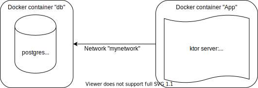

[](https://kotlinlang.org/)
[](https://ktor.io/)
[](https://github.com/papsign/Ktor-OpenAPI-Generator)
[](https://github.com/papsign/Ktor-OpenAPI-Generator)

[](https://docs.docker.com/compose/)
[](https://github.com/SerVB/e-shop/actions)
# e-shop
## Running in Docker
You can run the project easily using Docker:
```shell script
docker-compose up
```

After that, you can check Swagger UI at <http://localhost:8080/swagger-ui> for the API description.

## Running locally
If you want to check it out locally, you should provide database like this:
```shell script
docker run -e POSTGRES_PASSWORD=123 -e POSTGRES_USER=user -e POSTGRES_DB=mydb -p 5432:5432 postgres:9.6
```

After this, you can run `./gradlew run`. Don't forget about setting env like in docker-compose: `DB_USER=user;DB_HOST=localhost;DB_PORT=5432;DB_DB=mydb;DB_PASSWORD=123`.

Another option is to disable database storage. Just run `./gradlew run` with env `io.github.servb.eShop.forceInMemory=true`.

## Architecture graph


## Rules
- [x] Public repo.
- [x] Task per branch.
- [x] Description.
- [x] Architecture graph.
- [x] Swagger UI.
- [x] Docker-compose.

## Stages
### 1. 2020.02.08 – 2020.03.15
Rest API:
- [x] Create a product.
- [x] Remove a product.
- [x] Return a list of products.
- [x] Return a product.
- [x] Edit a product.

"Product" entity:
* Name.
* ID.
* Type.

Extra points:
- [x] Pagination in list of products.
- [x] Data storage in DB.
- [x] Versioning.
- [x] Logging.
